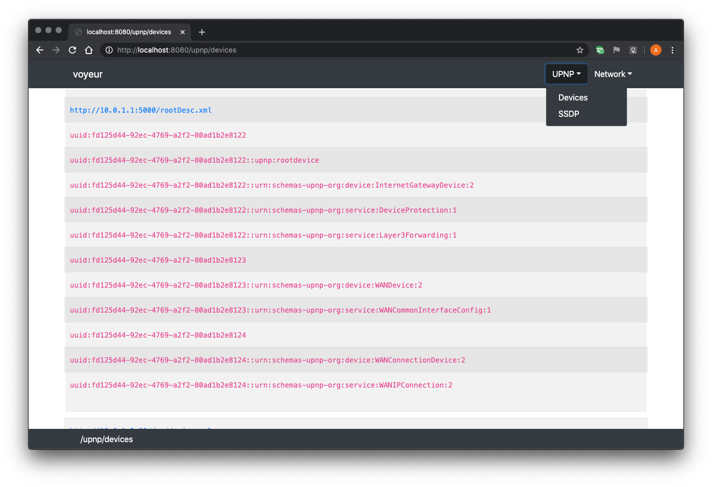
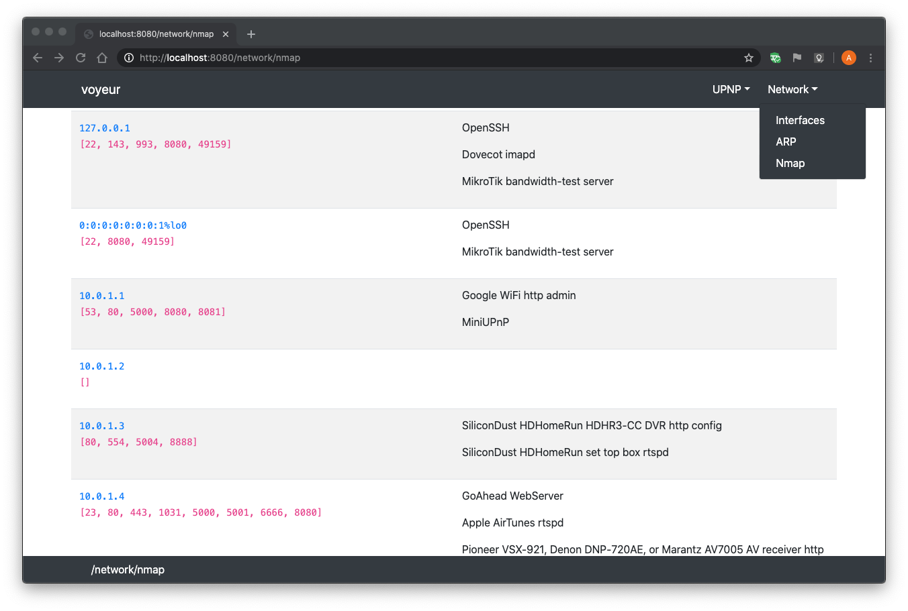

voyeur
======

Description
-----------

A Spring Boot Web server which provides reference information for
[UPNP](https://openconnectivity.org/developer/specifications/upnp-resources/upnp-developer-resources),
[SSDP](https://tools.ietf.org/id/draft-cai-ssdp-v1-03.txt), and
[`nmap`](https://nmap.org/) output for hosts found on the LAN.

Installation
------------
`nmap` should be available on the shell path.

To run the pre-compiled binary:

```bash
mvn -B dependency:get \
    -DremoteRepositories=https://repo.hcf.dev/maven/release \
    -Dartifact=ball:voyeur:1.0.1:jar:bin
bash ${HOME}/.m2/repository/ball/voyeur/1.0.1/voyeur-1.0.1-bin.jar &
open http://localhost:8080/
```

To compile and run locally:

```bash
git clone https://github.com/allen-ball/voyeur.git
cd voyeur
mvn -Pspring-boot:run
```

and then (from another shell):

```bash
open http://localhost:8080/
```

Usage
-----

Sample UPNP screenshot:




Sample Nmap screenshot:



License
-------

This code is under the
[Apache License, Version 2.0, January 2004](https://www.apache.org/licenses/LICENSE-2.0).
